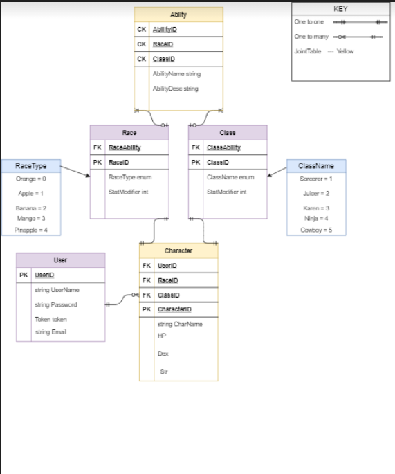

# CustomCharacterApi
A RESTful API for creating, reading, updating and deleting stored custom characters

## Authors: Ameilia Valdes, Matthew Petersen, David Dicken, Alan Hung, Jordan Kidwell

## Explanation of Tables:
- **User Table**: Starting here, the user will be created with a login. 
    - 1:Many relationship with character table, as one user can have many characters.
- **Character Table**: Holds foreign keys for UserID, RaceID, ClassID and CharacterID. The properties contained within are the character name the user will create, along with strength, dexterity and HP that will be updated based on level. 
    - 1:1 relationship with race and class, as each character can have just one of each 
- **Race Table**: Holds a foreign key for race ability and it's own primary key raceID. 
    - The raceID is called in the ability table with a 1:Many relationship, as one race can have many abilites.
    - RaceType Enum will be called based on number, what sort of race the user chooses to play as. This will be seeded data
- **Class Table**: Holds a foreign key for class ability and primary key for ClassID. 
    - The classID is called in our ability table with a 1:Many relationship, as one class can have many abilities.
    - ClassName Enum will be called based on number, what sort of class the user choose to play as. This will also be seeded data
- **Ability Table**: Holds composite keys to AbilityID, RaceID and ClassID, with properties set as AbilityName and AbilityDescription that varies based on race/class. 
